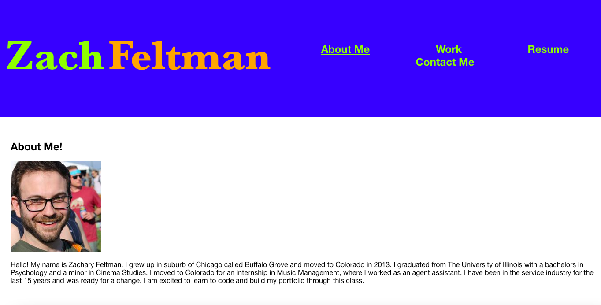

# React Portfolio
This is my portfolio page reconfigured to use react elements.  It is a single page application viewers can see information about me, my previous projects, my resume, and a section in which to contact me if they would like.

## Objectives

 - When the user first opens the portfolio application, they are brought to a page that has information about me.  This has a head/nav bar,  content about me sections, and a footer.
 - When they see the header there is my name, as well as links to different sections of the portfolio.
 - When the user clicks any of the sections in the navigation bar, then they are taken to that section of the portfolio, and the section they are currently on will stay underlined to mark where they are currently looking.
 - In the about me section, there is a picture of me and a short exert about me.
 - In the projects section, there are 6 cards for project worked on.
 - In the contact me sections, there are fields for name, email, and a message to leave me.
 - If the user clicks into the one of these fields to enters their information, but then clicks out, they are notified that the information is incomplete or incorrect.
 - When the user clicks on my resume link, the are brought to a page that has my resume loaded, and a way to download the resume if desired.
 - In the footer is information about my Github and email again for ways to reach me.

## Live Link
https://zacharyfeltman.github.io/react-portfolio/

## Screenshot

